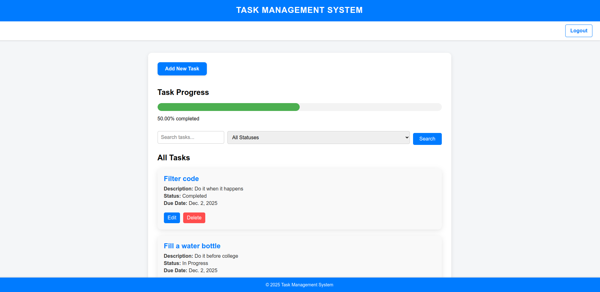
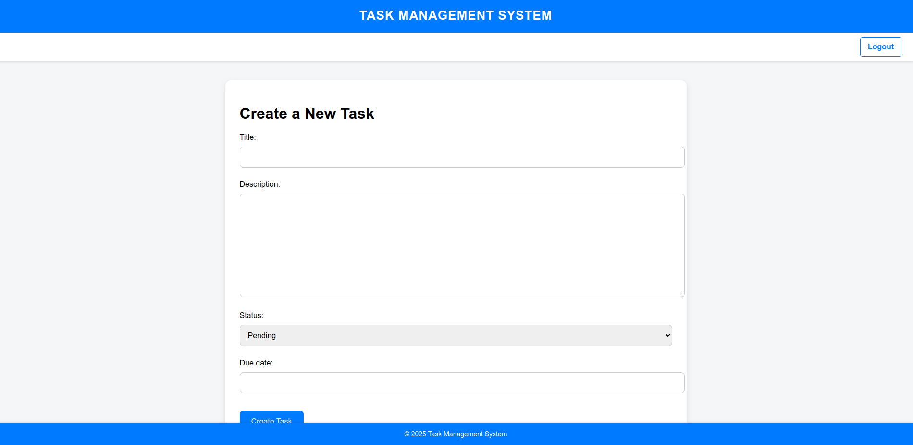
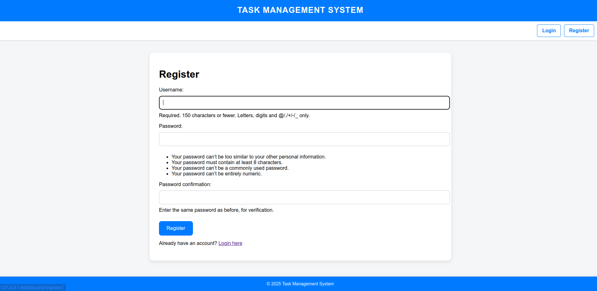

# Task Management System

This is a web-based **Task Management System** built using **Django** and **SQLite3**. It allows users to register, log in, and manage their tasks with features like task creation, updates, deletions, progress tracking, and more.

---

## Features

- **User Authentication:**
  - User registration
  - Login/Logout functionality
  - Only logged-in users can access their tasks

- **Task Management:**
  - Create new tasks
  - Edit existing tasks
  - Delete tasks
  - Search tasks by title or description
  - Filter tasks by status (Pending, In Progress, Completed)

- **Progress Tracking:**
  - A progress bar to visually display the percentage of tasks completed by the user

---

## Usage

1. Visit `http://127.0.0.1:8000/` in your browser.
2. Register a new account or log in using your credentials.
3. Create, update, delete, and manage your tasks easily.
4. Use the search bar to find tasks and filter them by status.
5. Track your task completion progress through the progress bar.

---

## File Structure
```bash
task_management_system/
├── core/
│   ├── migrations/
│   ├── views.py
│   └── models.py
├── templates/
│   ├── core/
│   │   ├── home.html
│   │   ├── task_create.html
│   │   └── task_form.html
│   ├── partials/
│   │   └── base.html
│   └── authentication/
│       ├── login.html
│       └── register.html
├── authentication/
│   └── views.py
├── manage.py
└── README.md
```


---

## Technologies Used

- **Python**
- **Django**
- **SQLite3**
- **HTML/CSS**
- **Bootstrap** (for styling)

---

## Screenshots

### **Home Page:**


### **Task Create Page:**


### **Register Page:**


---

## License
This project is licensed under the **MIT License**.


